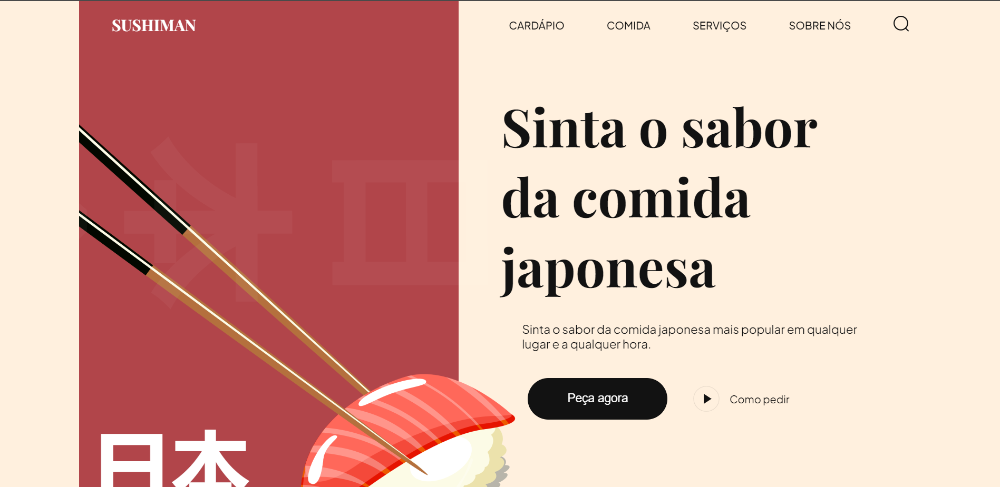

<h1 align="center">Sushiman </h1>

 Projeto perssoal.  

  <a href="#-tecnologias">Tecnologias</a>&nbsp;&nbsp;&nbsp;|&nbsp;&nbsp;&nbsp;
  <a href="#-projeto">Projeto</a>&nbsp;&nbsp;&nbsp;|&nbsp;&nbsp;&nbsp;
  <a href="#-layout">Layout</a>&nbsp;&nbsp;&nbsp;|&nbsp;&nbsp;&nbsp;
  <a href="#memo-licença">Licença</a>

  

 

   

## 🚀 Tecnologias

Esse projeto foi desenvolvido com as seguintes tecnologias:

- HTML e CSS
- Javascript
- Vite
- Github

## 💻 Projeto

  Um site completo para uma loja de sushi

- [Acesse o projeto finalizado, online](https://hendersonsousa20.github.io/Sushi/)

## :memo: Licença

Esse projeto está sob a licença MIT.
